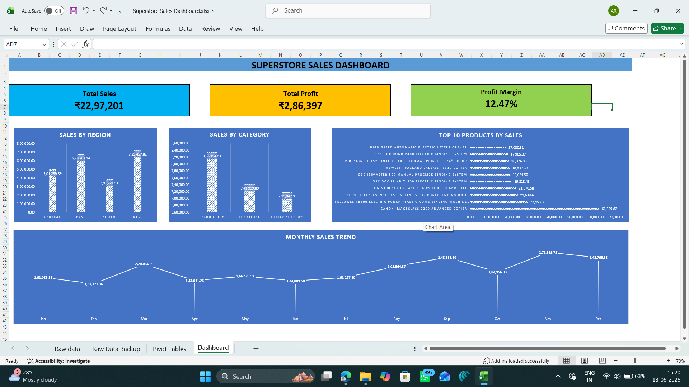

\# Excel Superstore Sales Dashboard

## Dashboard Preview




\---


\# Project Overview


This project showcases an interactive Sales Dashboard built in Microsoft Excel using the Superstore Sales dataset. The dashboard was designed to convert raw sales data into meaningful business insights through KPI reporting, trend analysis, and interactive visualizations.


The report enables business users to quickly evaluate overall sales performance, identify high-performing products and regions, and monitor key performance indicators without manually analyzing thousands of records.


\---


\# Business Problem


Organizations generate large volumes of sales data every day, making it difficult for decision-makers to identify trends and evaluate performance using spreadsheets alone.


The objective of this project was to create a centralized dashboard that simplifies sales reporting and provides management with quick, actionable insights.


\---


\# Business Objectives


\* Monitor overall sales performance

\* Track business profitability

\* Analyze monthly sales trends

\* Compare regional performance

\* Identify top-selling products

\* Support faster business decision-making


\---


\# Dataset Information


\*\*Dataset:\*\* Superstore Sales Dataset


The dataset contains information related to:


\* Orders

\* Customers

\* Products

\* Categories

\* Sub-Categories

\* Regions

\* Sales

\* Profit

\* Quantity

\* Discounts

\* Shipping Details


\---


\# Tools \& Technologies Used


\* Microsoft Excel

\* Pivot Tables

\* Pivot Charts

\* Slicers

\* Excel Functions

\* Conditional Formatting


\---


\# Dashboard KPIs


\* Total Sales

\* Total Profit

\* Profit Margin (%)


\---


\# Dashboard Visuals


\* Monthly Sales Trend

\* Sales by Region

\* Sales by Category

\* Top 10 Products by Sales


\---


\# Key Features


\* Interactive dashboard with slicers

\* Executive KPI summary

\* Monthly sales trend analysis

\* Regional sales comparison

\* Product performance analysis

\* Professional dashboard layout

\* Business-oriented visualizations


\---


## Key Business Insights

* The **West** region generated the highest sales (**₹7.25M**), while the **South** region recorded the lowest sales (**₹3.92M**), highlighting a significant regional performance gap.

* **Technology** was the highest revenue-generating product category (**₹8.36M**), followed by **Furniture**, while **Office Supplies** contributed the least sales.

* The **Canon imageCLASS 2200 Advanced Copier** was the top-selling product, generating approximately **₹61.99K** in sales, making it the best-performing product in the portfolio.

* Monthly sales showed fluctuations throughout the year, with **November** recording the highest sales (**₹2.72M**), indicating a strong year-end sales period.

* The business generated **Total Sales of ₹22.97M** with an overall **Profit Margin of 12.47%**, reflecting healthy business performance and profitability.

* The dashboard combines KPI reporting with regional, category, product, and monthly trend analysis, enabling management to quickly identify business performance and support data-driven decision-making.


\---


\# Skills Demonstrated


\* Data Cleaning

\* Data Validation

\* Dashboard Design

\* KPI Development

\* Pivot Table Analysis

\* Pivot Chart Visualization

\* Business Analysis

\* Data Visualization

\* Excel Reporting


\---


\# Project Structure


```text

Project 1 - Excel Superstore Sales Dashboard

│

├── Dataset

├── Excel Dashboard

├── Dashboard Screenshots

├── Documentation

└── README.md

```


\---


\# How to Use


1\. Download the project files.

2\. Open the Excel dashboard.

3\. Use the slicers to filter the data.

4\. Explore KPIs and charts to analyze sales performance.

5\. Review the documentation for additional project details.


\---


\# Conclusion


This project demonstrates how Microsoft Excel can be used to transform raw sales data into a structured, interactive dashboard for business reporting. It highlights practical skills in data analysis, KPI reporting, dashboard design, and business storytelling while presenting information in a clear and decision-focused format.


\---


\# Author


\*\*Abdul Raheem\*\*


MBA (Finance \& Business Analytics)


Aspiring Data Analyst | MIS Analyst | Reporting Analyst | Business Analyst


