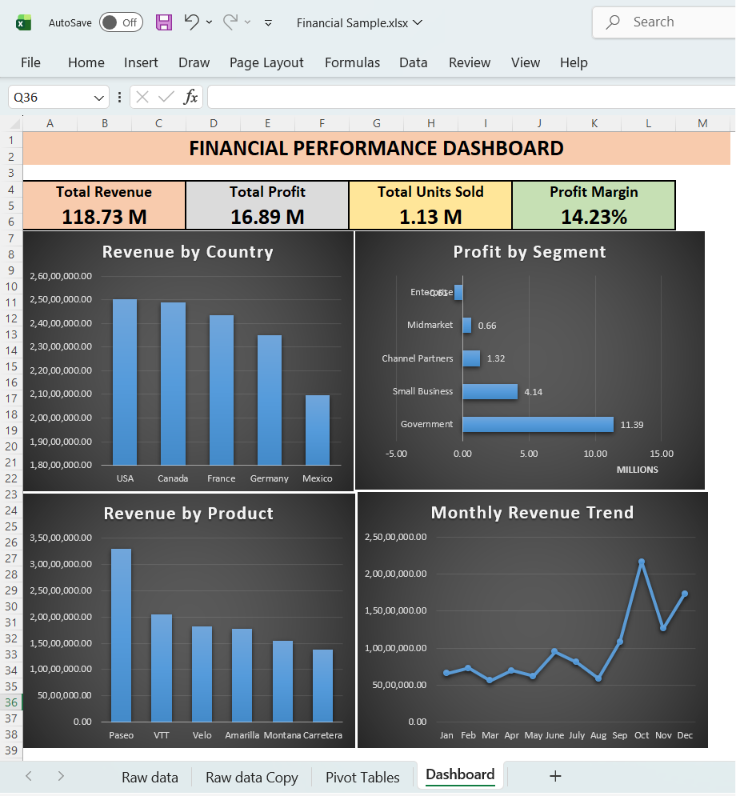

## Excel Financial Performance Dashboard


\---

## Dashboard Preview




## Project Overview


This project focuses on analyzing an organization's financial performance using Microsoft Excel. The dashboard transforms raw financial data into a structured and interactive report that helps monitor revenue, profitability, product performance, and business segments.


The objective of this project was to build a dashboard that allows management to evaluate financial health, identify profitable business areas, and support strategic decision-making through clear and interactive visualizations.


\---


## Business Problem


Financial data is often stored in large spreadsheets, making it difficult to identify trends, compare business segments, and evaluate profitability efficiently.


This project addresses that challenge by consolidating key financial metrics into a single interactive dashboard, enabling faster analysis and better business decisions.


\---


## Business Objectives


\* Monitor overall financial performance.

\* Evaluate revenue and profitability.

\* Compare business performance across countries.

\* Analyze product-wise revenue contribution.

\* Identify profitable business segments.

\* Support financial planning through interactive reporting.


\---


## Dataset Information


\*\*Dataset:\*\* Financial Sample Dataset


The dataset contains information related to:


\* Countries

\* Products

\* Business Segments

\* Sales Revenue

\* Cost of Goods Sold (COGS)

\* Gross Profit

\* Units Sold

\* Discounts

\* Manufacturing Price

\* Sale Price

\* Dates


\---


## Tools \& Technologies Used


\* Microsoft Excel

\* Pivot Tables

\* Pivot Charts

\* Slicers

\* Excel Functions

\* Conditional Formatting


\---


## Dashboard KPIs


\* Total Revenue

\* Total Profit

\* Total Units Sold

\* Profit Margin (%)


\---


## Dashboard Visuals


\* Revenue by Country

\* Profit by Segment

\* Revenue by Product

\* Monthly Revenue Trend


\---


## Key Features


\* Interactive financial dashboard

\* Executive KPI summary

\* Country-wise financial analysis

\* Product performance analysis

\* Business segment comparison

\* Monthly revenue trend analysis

\* Clean and professional dashboard design


\---

### Key Business Insights


* The \*\*USA\*\* generated the highest revenue among all countries, making it the strongest performing market, while \*\*Mexico\*\* recorded the lowest revenue.

* The \*\*Government\*\* segment delivered the highest profit (\*\*11.39M\*\*), contributing significantly to overall business profitability.

* The \*\*Enterprise\*\* segment reported a \*\*negative profit\*\*, indicating an area that requires further business analysis and improvement.

* \*\*Paseo\*\* was the highest revenue-generating product, making it the top-performing product in the portfolio.

* \*\*October\*\* recorded the highest monthly revenue, highlighting a strong sales period compared to the rest of the year.

* The business achieved an overall \*\*Profit Margin of 14.23%\*\*, indicating healthy profitability across its operations.


\---


## Skills Demonstrated


* Financial Data Analysis

* Data Cleaning

* Dashboard Design

* KPI Development

* Pivot Table Analysis

* Pivot Chart Visualization

* Financial Reporting

* Business Analysis

* Data Visualization


\---


\# Project Structure


```text

Project 2 - Excel Financial Performance Dashboard

│

├── Dataset

├── Excel Dashboard

├── Dashboard Screenshot

├── Documentation

└── README.md

```


\---


## How to Use


1\. Download the project files.

2\. Open the Excel dashboard.

3\. Use the interactive slicers to filter the data.

4\. Review KPIs to evaluate financial performance.

5\. Analyze charts to understand country, product, and segment performance.

6\. Refer to the documentation for additional project details.


\---


## Conclusion


This project demonstrates how Microsoft Excel can be used to build an interactive financial reporting dashboard for business analysis. By combining KPI reporting, financial visualizations, and interactive filtering, the dashboard enables users to monitor performance, compare business segments, and make informed financial decisions.


\---


## Author


\*\*Abdul Raheem\*\*


MBA (Finance \& Business Analytics)


Aspiring Data Analyst | MIS Analyst | Reporting Analyst | Business Analyst


