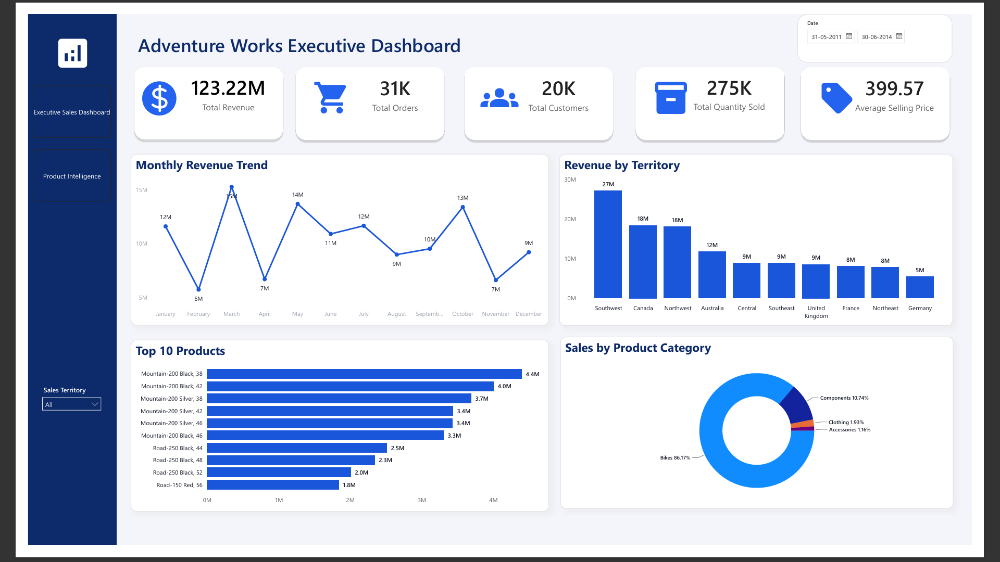
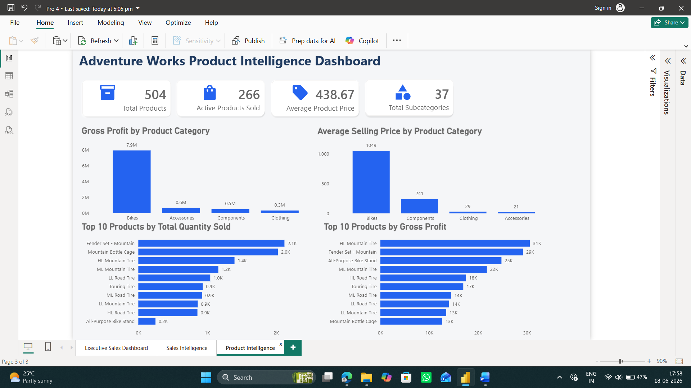
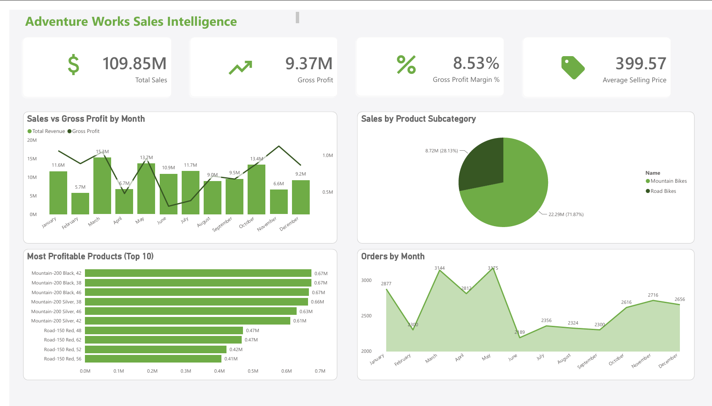

# Adventure Works Business Intelligence Dashboard

## Dashboard Preview

### Executive sales Dashboard

### Product Intelligence Dashboard

### Sales Intelligence Dashboard

---

# Project Overview

The Adventure Works Business Intelligence Dashboard is a multi-page interactive Power BI report designed to analyze sales, product performance, and business operations from different perspectives.

Instead of presenting all metrics on a single dashboard, the report is divided into three dedicated analytical pages. Each page answers a different business question, helping decision-makers understand overall performance, monitor sales trends, and evaluate product profitability.

The project demonstrates practical Business Intelligence concepts such as data modeling, DAX calculations, KPI reporting, and interactive dashboard development.

---

# Business Problem

Business managers often struggle to extract meaningful insights from large volumes of transactional sales data. Static reports make it difficult to understand business performance across different dimensions such as products, territories, and time.

The objective of this project was to build an interactive Business Intelligence solution that transforms raw sales data into meaningful insights for business decision-making.

---

# Business Objectives

* Monitor overall business performance.

* Track sales and profitability.

* Analyze sales trends over time.

* Compare territory-wise revenue.

* Evaluate product performance.

* Identify high-performing products.

* Analyze product categories and subcategories.

* Support business decisions through interactive reporting.

---

# Dataset Information

**Dataset:** Adventure Works Sales Dataset

The dataset includes information related to:

* Sales Orders

* Products

* Product Categories

* Product Subcategories

* Customers

* Sales Territories

* Dates

* Revenue

* Gross Profit

* Quantity Sold

* Order Details

---

# Tools & Technologies Used

* Microsoft Power BI

* Power Query

* Data Modeling

* DAX

* Interactive Visualizations

* Slicers

* Matrix Visuals

---

# Dashboard Pages

### Executive Sales Dashboard

Provides an executive-level overview of overall business performance through KPIs and high-level visualizations.

Includes:

* Total Revenue

* Total Orders

* Total Customers

* Total Quantity Sold

* Average Selling Price

* Monthly Revenue Trend

* Revenue by Territory

* Sales by Product Category

* Top 10 Products

---

### Sales Intelligence Dashboard

Focuses on detailed sales analysis and profitability trends.

Includes:

* Total Sales

* Gross Profit

* Gross Profit Margin

* Average Selling Price

* Sales vs Gross Profit by Month

* Sales by Product Subcategory

* Orders by Month

* Most Profitable Products

---

### Product Intelligence Dashboard

Provides detailed analysis of product performance and profitability.

Includes:

* Total Products

* Active Products Sold

* Average Product Price

* Total Subcategories

*  Gross Profit by Product Category

* Average Selling Price by Product Category

* Top 10 Products by Quantity Sold

* Top 10 Products by Gross Profit

---

# KPIs Used

* Total Revenue

* Total Sales

* Total Orders

* Total Customers

* Total Quantity Sold

* Gross Profit

* Gross Profit Margin %

* Average Selling Price

* Average Product Price

* Total Products

* Active Products Sold

* Total Subcategories

---

# Skills Demonstrated

* Data Cleaning

* Power Query

* Data Modeling

* DAX Measures

* KPI Development

* Business Intelligence

* Dashboard Design

* Interactive Reporting

* Data Visualization

* Business Analysis

* Power BI Best Practices

---

# Key Business Insights

### Executive Sales Dashboard

* Southwest generated the highest revenue among all sales territories.

* Bikes contributed the highest revenue, significantly outperforming other product categories.

* Monthly revenue peaked in March and November, indicating strong seasonal sales performance.

* A small group of products contributed a significant share of total revenue.

### Sales Intelligence Dashboard

* Gross Profit followed sales trends closely throughout the year.

* Mountain Bikes generated substantially higher sales than Road Bikes.

* The most profitable products were primarily Mountain Bike models.

* Monthly order volume remained relatively consistent with noticeable peaks during March and May.

### Product Intelligence Dashboard

* Bikes generated the highest gross profit among all product categories.

* Bikes also recorded the highest average selling price.

* Fender Set - Mountain and Mountain Bottle Cage were among the highest-selling products by quantity.

* HL Mountain Tire generated the highest gross profit among individual products.

---

# Key Features

* Multi-page Business Intelligence Dashboard

* Interactive KPI Cards

* Territory Analysis

* Product Performance Analysis

* Profitability Analysis

* Trend Analysis

* Business-focused Dashboard Design

* Interactive Filtering

* Executive Reporting

* Consistent Dashboard Layout

---

# Project Structure

Project 4 - Adventure Works Business Intelligence Dashboard

│

├── Dataset

├── Power BI Dashboard

├── Dashboard Screenshots

├── Documentation

└── README.md

\---

# How to Use

1. Download the project files.

2. Open the Power BI (.pbix) file.

3. Explore the Executive Sales Dashboard for an overall business summary.

4. Navigate to the Sales Intelligence Dashboard to analyze sales trends and profitability.

5. Open the Product Intelligence Dashboard to evaluate product performance and product-level insights.

6. Use the territory slicer to interactively filter the dashboard.

---

# Conclusion

This project demonstrates how Power BI can transform transactional sales data into an interactive Business Intelligence solution. By combining data modeling, DAX calculations, KPI reporting, and business-focused visualizations, the dashboard enables users to monitor business performance, identify trends, and make data-driven decisions across sales and product operations.

---

# Author

**Abdul Raheem**

MBA (Finance & Business Analytics)

Aspiring Data Analyst | MIS Analyst | Reporting Analyst | Business Analyst

